<h1 align="center"; style="text-align:center;">Laboratorio 2: Cinemática Directa - Phantom X - ROS</h1>
<p align="center";style="font-size:50px; background-color:pink; color:red; text-align:center;line-height : 60px; margin : 0; padding : 0;">
Robótica</p1>
<p align="center";style="font-size:50px; text-align:center; line-height : 40px;  margin-top : 0; margin-bottom : 0; "> <br> Giovanni Andrés Páez Ujueta</p>
<p align="center";style="font-size:50px; text-align:center; line-height : 20px; margin-top : 0; "> email: gpaezu@unal.edu.co</p>
<p align="center"; style="font-size:50px; text-align:center; line-height : 40px;  margin-top : 0; margin-bottom : 0; "> <br> Daniel Esteban Bohórquez Cifuentes</p>
<p align="center"; style="font-size:50px; text-align:center; line-height : 20px; margin-top : 0; "> email: dbohorquezc@unal.edu.co</p>
<p align="center"; style="font-size:50px; text-align:center; line-height : 30px;  margin-top : 0; margin-bottom : 0; "> <br><br>INGENIERÍA MECATRÓNICA</p>
<p align="center"; style="font-size:50px; text-align:center; line-height : 30px; margin-top : 0; "> Facultad de Ingeniería</p>
<p align="center"; style="font-size:50px; text-align:center; line-height : 30px; margin-top : 0; "> Universidad Nacional de Colombia Sede Bogotá</p>
<br>
<p align="center">
  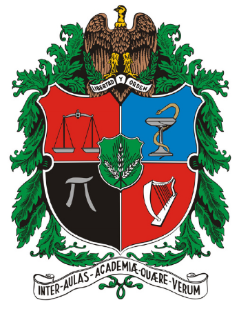
</p>

<p align="center"; style="font-size:50px; text-align:center; line-height : 30px; margin-top : 0; "> <br>13 de mayo de 2022</p>

## Metodología

### Mediciones
Por medio de un calibrador se obtienes la medidas con las cuales se realiza un diagrama para tener una idea basica de las juntas que presenta el robot (Imagen de la izquierda). Con este avance se procede a realizar el análisis de DHstd por medio de la ubicación de los marcos de referencia en el diagrama (Diagrama de la derecha) y su respectiva tabla.
<p align="center">
  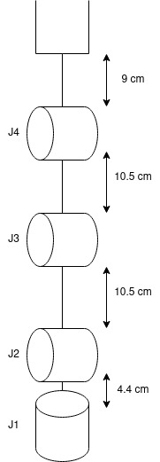
  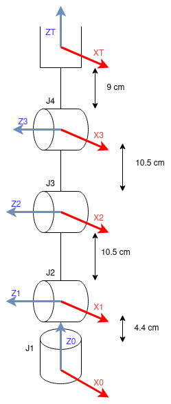
</p>

### Análisis
Obteniendo asi la siguiente tabla mostrada en el software de Matlab, el cual por medio de la librería de Peter Corke se representa un modelo del robot que permita evidenciar la orientación de cada articulación y sus respectivos eslabones. 
<p align="center">
  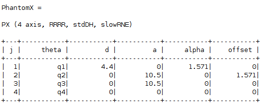
</p>
<p align="center">
  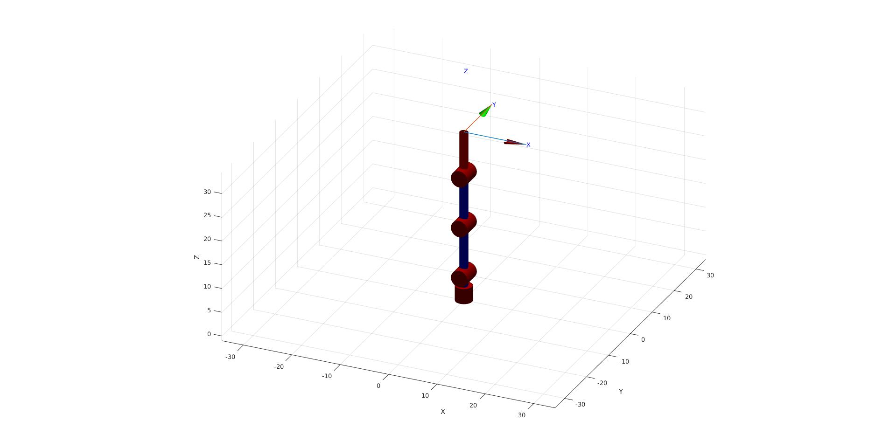
</p>

### ROS

Para este punto,  se partio de realizar movimientos al robot por la consola para tener un primer acercamiento con el comportamiento de robot, y posteriormente si se procedio a ver controlar su movimiento desde un  Script de Python y RViz.Cabe mencionar que para todos estros procesos es necesario chequear y habilitar el puerto que se haya activado al conectar el robot, esto se realiza con:
```
ls /dev/tty*
sudo chmod 777 /dev/ttyUSB0
```

A continuacion se explicará el codigo de python.

Se importaron las librerias 
```
#!/usr/bin/env python3
import rospy
import time
from geometry_msgs.msg import Twist 
import termios, sys, os
# from std_msgs.msg import String
from dynamixel_workbench_msgs.srv import DynamixelCommand
```

Se define la funcion getkey, que permitte interactuar con el teclado dentro de la terminal de VScode donde se haya ejecutado el archivo.
```
def getkey():
    fd = sys.stdin.fileno()
    old = termios.tcgetattr(fd)
    new = termios.tcgetattr(fd)
    new[3] = new[3] & ~TERMIOS.ICANON & ~TERMIOS.ECHO
    new[6][TERMIOS.VMIN] = 1
    new[6][TERMIOS.VTIME] = 0
    termios.tcsetattr(fd, TERMIOS.TCSANOW, new)
    c = None
    try:
        c = os.read(fd, 1)
    finally:
        termios.tcsetattr(fd, TERMIOS.TCSAFLUSH, old)
    return c
```
Se define la funcion jointCommand, la cual incializa un nodo, y se crea la funcion para que permirta interactuar con los servicion de dynamixel, de forma que se entrega el comando, el ID de la articulacion, el addr_name, que tiene que ver con la accion que se va a realizar, el valor a cambiar o objetivo y el tiempo.

```
def jointCommand(command, id_num, addr_name, value, time):
    #rospy.init_node('joint_node', anonymous=False)
    rospy.wait_for_service('dynamixel_workbench/dynamixel_command')
    try:        
        dynamixel_command = rospy.ServiceProxy(
            '/dynamixel_workbench/dynamixel_command', DynamixelCommand)
        result = dynamixel_command(command,id_num,addr_name,value)
        rospy.sleep(time)
        return result.comm_result
    except rospy.ServiceException as exc:
        print(str(exc))
```
La siguientes lineas de codigo son las que permiten entrelazar el mando por teclado y los servicios de dynamixel. Por medio de un while(), se ejecuta la accion indefinida mente hasta que se termine el proceso con la tecla 'ESC', en este ciclo la idea es brindar las funciones a las teclas 'w', 'a', 's' y 'd'; para esto, se crea una variable i la cual representa la articulacion actual, esta siempre inicializando en uno (*"waist"*), a continacuacion se explicara el proceso de cambiar de junta: por medio de un if, cuando se presiona 'w' se le sumará uno a la variable i, y así pasando en la siguiente articulacion, cuando se supera el valor de 4, i vuelve a tomar el valor de 1; por el contrario, por medio de un if, cuando se presiona 's' se le restará uno a la variable i, y así pasando a la articulacion previa, cuando se esta por debajo del valor de 1, i vuelve toma el valor de 4. Para retornar a la posicion de Home, se pulsa la tecla 'a', que posteriormente por medio de la funcion jointCommand, resive la articulacion actual, y el valor 512, preestablecido por defecto para todas las articulaciones como Home. Finalmente con la tecla 'd', se coloan 4 casos posibles usando la sentencia if - Elif, que busca tener como objetivo evaluar en que tecla se esta y verificar el Objetivo independiente que le opertenece a dicha junta, que finalmente será movida con la funcion jointCommand.

```
if __name__ == '__main__':
    try:
        # Goal_Position (0,1023)
        # Torque_Limit (0,1023)
        i=1
        home=512
        Obj=[480,400,300,300]
        while(1):
            Tec=getkey()
            if Tec==b'w':
                i=i+1
                if i == 5:
                    i=1
                print('Está en la articulacíon '+str(i))
            if Tec==b'a':
                jointCommand('', i, 'Torque_Limit', 500, 0)
                jointCommand('', i, 'Goal_Position', 512, 0.5)
            if Tec==b's':
                i=i-1
                if i == 0:
                    i=4
                print('Está en la articulacíon '+str(i))
            if Tec==b'd': 
                if i==1:
                    jointCommand('', 1, 'Goal_Position', Obj[0], 0.5)
                elif i==2:
                    jointCommand('', 2, 'Torque_Limit', 500, 0)
                    jointCommand('', 2, 'Goal_Position', Obj[1], 0.5) 
                elif i==3:
                    jointCommand('', 3, 'Goal_Position', Obj[2], 0.5)
                elif i==4:
                    jointCommand('', 4, 'Goal_Position', Obj[3], 0.5)
            if Tec==b'\x1b':
                break   
        
    except rospy.ROSInterruptException:
        pass
```
A continuacion se presentan los videos evidencia de ejecuacion con el robot y la visualizzacion en RViz, [video parte 1](https://www.youtube.com/watch?v=S8tb4s8Rve8)
[video parte 2](https://www.youtube.com/watch?v=MQF8JFIcQtE).
### Toolbox
Como se mostro en el análsis la tabla obtenida se obtuvo por medio de la función SerialLink generando así el siguiente código.

```
q_deg=[0 0 0 0];
q_rad=q_deg*(pi/180);
l=[4.4,10.5,10.5 9];
L(1) = Link('revolute','alpha',pi/2,'a',0,'d',l(1),'offset',0);
L(2) = Link('revolute','alpha',0,'a',l(2),'d',0,'offset',pi/2);
L(3) = Link('revolute','alpha',0,'a',l(3),'d',0,'offset',0);
L(4) = Link('revolute','alpha',0,'a',0,'d',0,'offset',0);

PhantomX=SerialLink(L,'name','PX');
PhantomX.tool=[0 0 1 l(4);-1 0 0 0;0 -1 0 0;0 0 0 1];
figure
PhantomX.plot(q_deg,'notiles','noname','floorlevel',-1);
``` 
En primer lugar se crea dos variables que contengan un arreglo, en este caso la primera es la posición objetivo en radianes que para iniciar se pone en HOME y la segunda contiene los valores de las articulaciones mostradas al inicio. Con esto realizado añaden los parametros de DH hallados previamente y con esto se crea el robot teniendo en cuenta que se configura una herramienta por medio del método .tool y su respectiva MTH. Por último como método de comprobación se grafica el robot en diferentes posiciones:
<p align="center">
  
  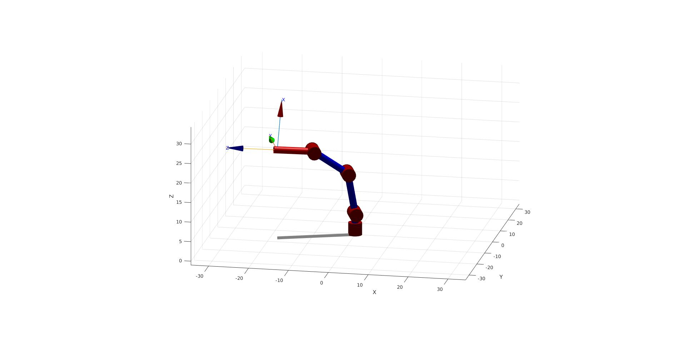
  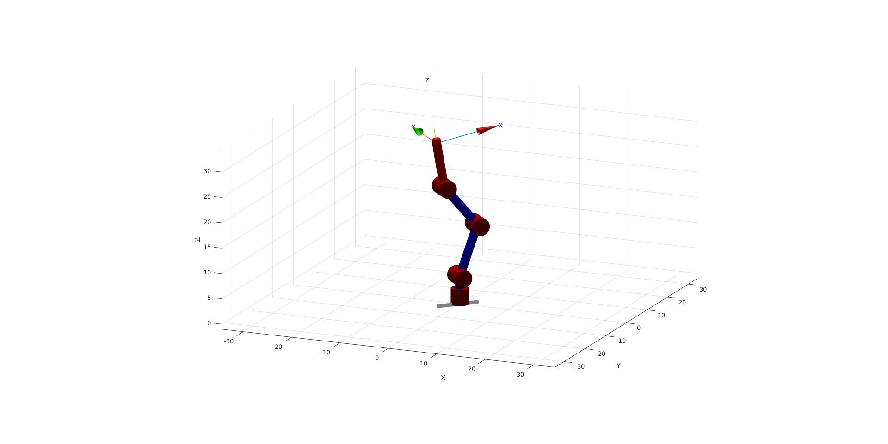
  
  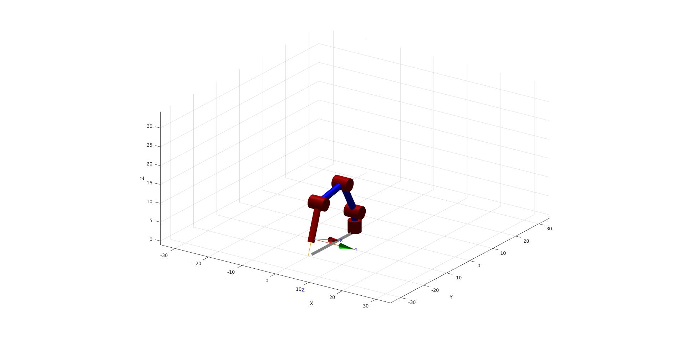
  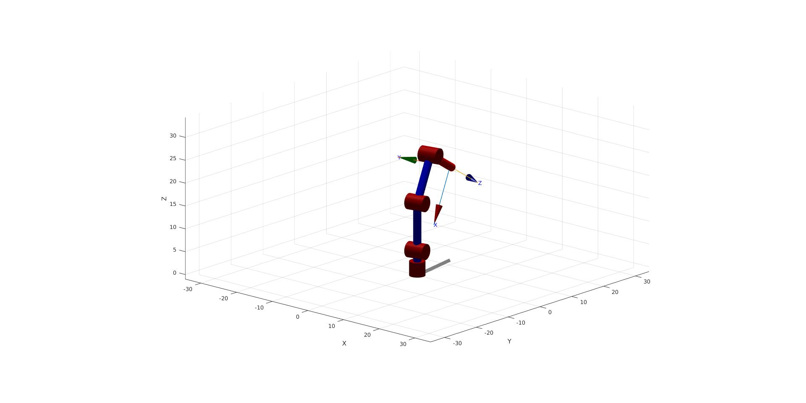
</p>

### Conexión con Matlab

Para esta sección se tiene como objetivo realizar un código que permita publicar en los tópicos del controldor de la junta, pero para esto se realiza un análisis de los límites de la articulación, primero se sabe que este tipo de robot tiene motores con una resolución de 1024 bits por lo tanto lo que resta es conocer los ángulos limite, para lo cual se utilizó el programa de Dynamixel Wizard el cual al realizar la conexión el robot permite evidenciar información de cada uno de los motores incluyendo el ángulo requerido, que para este tipo de motores es 300 grados distribuidos de -150° a 150° por lo tanto lo que faltaria realizar un mapeo que permita recibir los ángulos en grados y transformarlos en bits, por lo tanto se hizó uso de la siguinete función:
```
round(mapfun(q_deg(),-150,150,0,1023))
```
Como se evidencia se tiene los valores limites en grados y en bits junto con una entrada en grados que seria el objetivo a donde se quiere mover la junta, el round se utiliza para aproximar al entero mas cercano dado que este es el tipo de dato que solicita el tópico.
Con esto hecho se procede a realiza el codigo de publicación:
```
%%
clc
clear
rosshutdown
rosinit;
%%
motorSvcClient = rossvcclient('/dynamixel_workbench/dynamixel_command');
motorCommandMsg= rosmessage(motorSvcClient);
```
En primera intancia se inicia en una terminal externa el nodo maestro con el comando "roscore", previo a esto se siguen los pasos utilizados para la conexión del robot en ROS y python, teniendo cuidado de que el launch que permite controlar las juntas tenga un funcionamiento adecuando ya que este es el que permite publicar las posiciones requeridas en cada motor.Como buena práctica se limpia la consola y la variables del workbench asi mismo se corta el nodo de matlab con ros si es el caso de que existiera y por último se crea de nuevo el nodo mencionado. Al igual que en el laboratorio 1para la publicación se crea un cliente que puede acceder al comando y un mensaje que en este caso es la posición.
```
motorCommandMsg.AddrName="Goal_Position";
motorCommandMsg.Id=i;
motorCommandMsg.Value=round(mapfun(q_deg(i),-150,150,0,1023));%bits
call(motorSvcClient,motorCommandMsg);
```
Creado el mensaje se verifican lo parámetros que solicita el tópico, que en este caso es el servicio, el ID del motor y el valor que como se mencionó previamente se postuló según los límites de los motores. Así mismo como es importante indicar posiciones tambien lo es, poder leerla sin necesidad de modificarlas, para esto se puede realizar un proceso de subscripción, esto por medio del estudio de los mensajes que se tienen a disposición, con este fin se implemento el siguiente código.
```
Sub=rossubscriber('/dynamixel_workbench/joint_states');
Sub.LatestMessage.Position
```
Despues de realizar el estudio mencionado se denota que el Dynamixel tiene un tipo de mensaje "joint_states" el cual al ejecutarlos se tienen diferentes salidas y entre ellas la posición mostrada en un vector de 5x1 indicando cada una de las juntas, dicho vector se intento imprimir con algunas de las opciones utilizadas en los comandos de matlab, pero se obtuvo un problema con la visualización de dichas posiciones ya que este vector y la ubicación del mismo no permitia imprimirlo ni guardarlo como variable, por esta razón se halló una solución provisional que es correr en consola el comando mostrado anteriormente donde indica la ruta del Sub y los metodos que tiene este.

### Matlab + ROS + Toolbox:
Para esta sección se hace una combinación del uso de los servicios de publicación mencionados anteriormente y el toolbox  de Peter Corke principalmente su herramienta de creación de robots y su respectiva visualización. Para esto se utilizó el siguiente código:
```
q_deg=[0 0 0 0];
q_rad=q_deg*(pi/180);
for i=1:length(q_deg)
    motorCommandMsg.AddrName="Goal_Position";
    motorCommandMsg.Id=i;
    motorCommandMsg.Value=round(mapfun(q_deg(i),-150,150,0,1023));%bits
    call(motorSvcClient,motorCommandMsg);
    pause(1);
end
l=[14.5,10.7,10.7 9];
L(1) = Link('revolute','alpha',pi/2,'a',0,'d',l(1),'offset',0);
L(2) = Link('revolute','alpha',0,'a',l(2),'d',0,'offset',pi/2);
L(3) = Link('revolute','alpha',0,'a',l(3),'d',0,'offset',0);
L(4) = Link('revolute','alpha',0,'a',0,'d',0,'offset',0);
PhantomX=SerialLink(L,'name','PX');
PhantomX.tool=[0 0 1 l(4);-1 0 0 0;0 -1 0 0;0 0 0 1];
figure
PhantomX.plot(q_rad,'notiles','noname','floorlevel',-1);
```
Teniendo este código y asegurandose que la conexiones al robot esten habilitadas y en funcionamiento, se ingresan los parametros de entrada, en este caso se tiene la variable "q_deg" la cual guardará los valores de articulación que se deseen en grados, se aclara que se crea otro arreglo para realizar la convversión a radianes con el fin de ingresar los parámetros iniciales de la función plot. Siguiendo los pasos crea un for que permita recorrer cada  articulación y publicar el valor que se ingreso, al finalizar esta pasrte se agrega un delay que teniendo en cuenta las pruebas echas en ROS-Python si no afecta el torque de lo motores se pueden tener movimientos abruptos y oscilaciones que en conjunto podrian generar una resonancia llevando al robo a voltearse si no se tiene sujeto a la base. Solo restaría utilizar las herramientas del SerialLink para obtener la visualización en matlab.
<p align="center">
  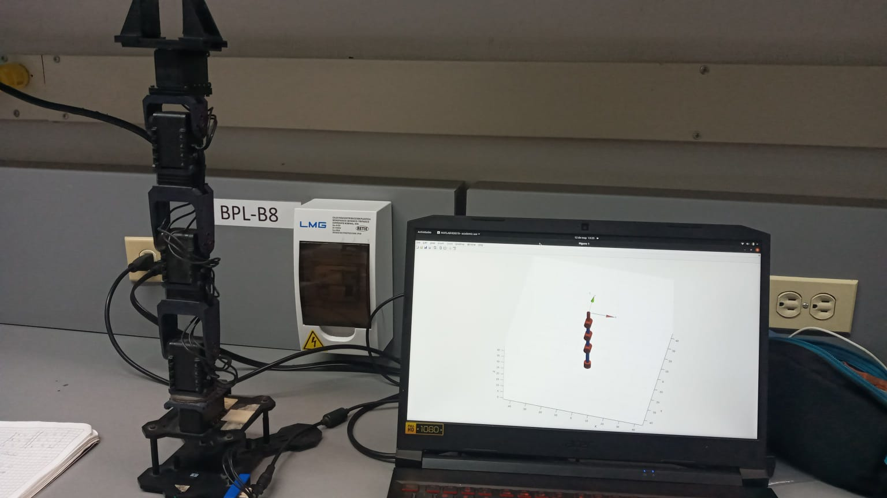
  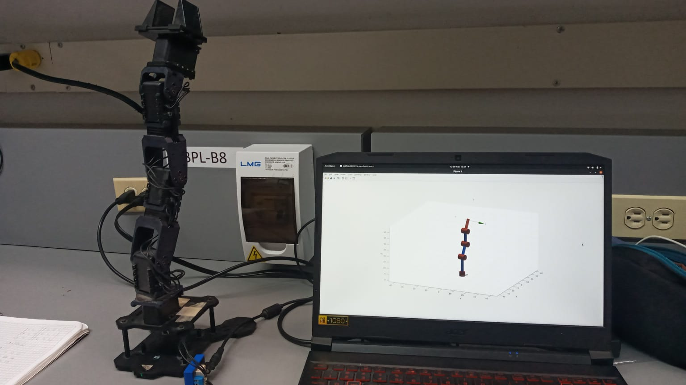
  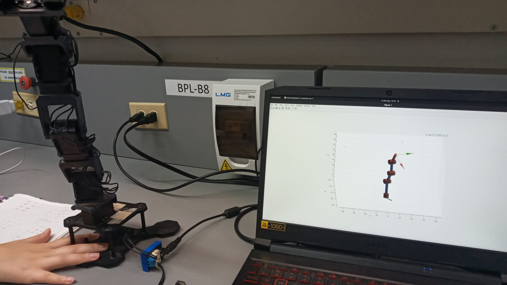
  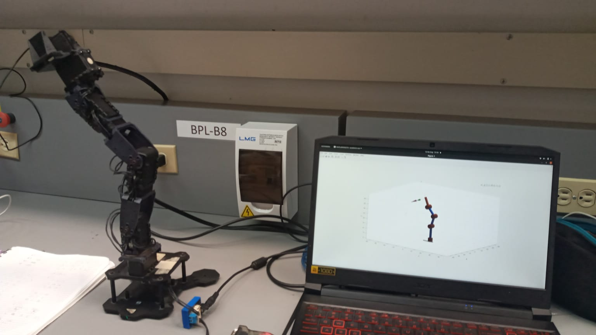
  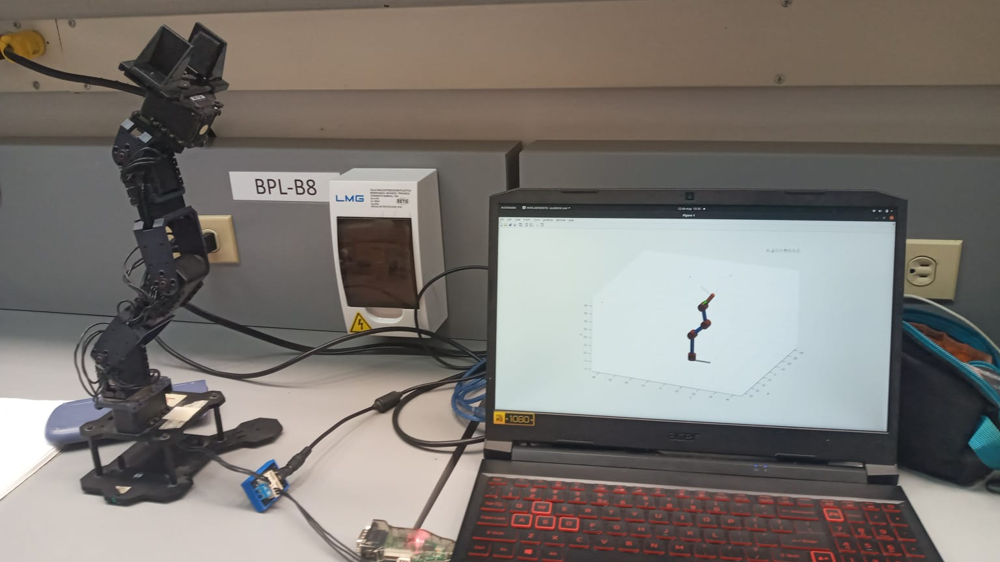
  
</p>
Se ṕuede evidenciar cada una de las posiciones requeridas respetivamente. A continuacion se presenta el video de esta seccion de MARLAB en el siguiente 
[video](https://www.youtube.com/watch?v=xyX3RvM0UJ0).


### Conclusiones

* Se concluye que se tuvo un acercamiento optimo a realizar acciones de movimiento basicas (en posicion, establesiendo torques limites), agregando una HMI que en este caso es un PC desde la interfaz de VS en Ubuntu.
* Tanto en MATLAB como en Python se pudo completar las espesicicaciones de la guia y tener un cumplimiento de lo que se espesificaba, se tienen los videos como evidencia del correcto movimiento de lo los robots *Phantom X Pincher*.
* Habiendo tenido este acercamiento, queda accesible la posibilidad de planear trayectorias, a las que se piensa como aporte cómo agregar  perfiles de velocidad espesicos para cuidar la integridad del robor.
